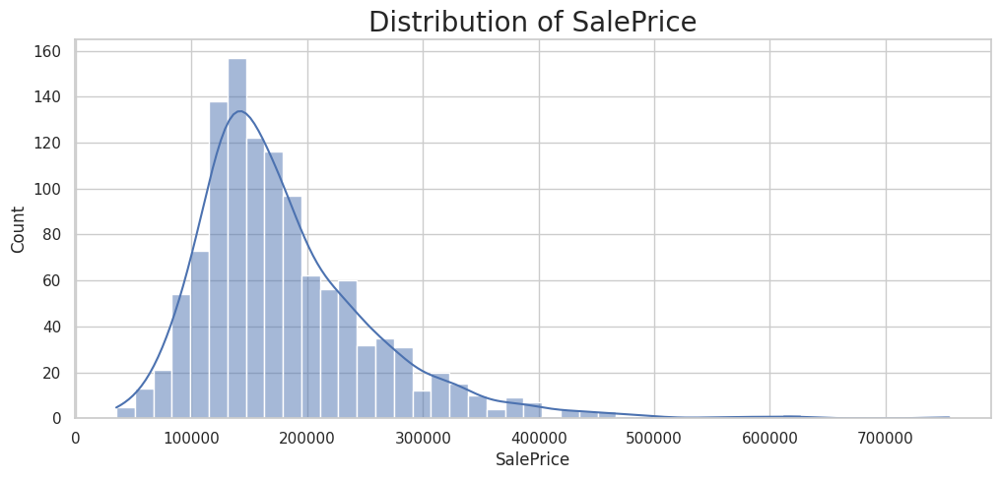
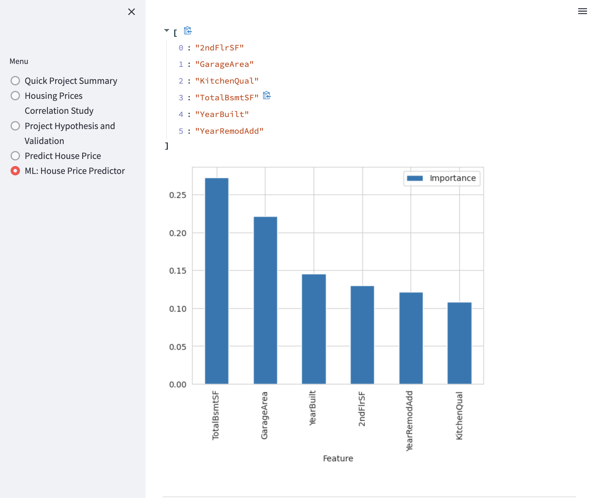

# **PriceProphet: Housing Price Predictor**

PriceProphet (Housing Price Forecaster) is a Machine Learning project designed to assist users in predicting house sales prices using house attributes as input.

## Table of Contents

1. [Dataset Content](#1-dataset-content)
2. [Business Requirements](#2-business-requirements)
    - [Epics](#epics)
    - [User Stories](#user-stories)
3. [Hypotheses and validation](#3-hypotheses-and-validation)
4. [Rationale to map the business requirements to the Data Visualizations and ML tasks](#4-rationale-to-map-the-business-requirements-to-the-data-visualizations-and-ml-tasks)
5. [ML Business Case](#5-ml-business-case)
6. [Dashboard Design](#6-dashboard-design)
   - [Page 1: Quick project summary](#page-1-quick-project-summary)
   - [Page 2: House prices Correlation Study](#page-2-house-prices-correlation-study)
   - [Page 3: Project hypotheses and validation](#3-hypotheses-and-validation)
   - [Page 4: Predict House price](#page-4-predict-house-price)
   - [Page 5: ML: House Price Predictor](#page-5-ml-house-price-predictor)
7. [Unfixed Bugs](#7-unfixed-bugs)
8. [Deployment](#8-deployment)
9. [Main Data Analysis and Machine Learning Libraries](#9-main-data-analysis-and-machine-learning-libraries)
10. [Credits](#10-credits)

## **1. Dataset Content**

* he project's dataset is derived from [Kaggle](https://www.kaggle.com/codeinstitute/housing-prices-data). We created a fictitious user scenario where predictive analytics can be applied in a real-world work setting.

* The dataset, which includes 1461 rows, represents housing records from Ames, Iowa. The dataset features 24 attributes indicative of the house profile (Floor Area, Basement, Garage, Kitchen, Lot, Porch, Wood Deck, Year Built) and its respective sales price for houses constructed between 1872 and 2010.

The table below denotes the variables, their descriptions, and measurement units. It's important to note that some variables are numerical while others are categorical.

|Variable|Meaning|Units|
|:----|:----|:----|
|1stFlrSF|First Floor square feet|334 - 4692|
|2ndFlrSF|Second floor square feet|0 - 2065|
|BedroomAbvGr|Bedrooms above grade (does NOT include basement bedrooms)|0 - 8|
|BsmtExposure|Refers to walkout or garden level walls|Gd: Good Exposure; Av: Average Exposure; Mn: Mimimum Exposure; No: No Exposure; None: No Basement|
|BsmtFinType1|Rating of basement finished area|GLQ: Good Living Quarters; ALQ: Average Living Quarters; BLQ: Below Average Living Quarters; Rec: Average Rec Room; LwQ: Low Quality; Unf: Unfinshed; None: No Basement|
|BsmtFinSF1|Type 1 finished square feet|0 - 5644|
|BsmtUnfSF|Unfinished square feet of basement area|0 - 2336|
|TotalBsmtSF|Total square feet of basement area|0 - 6110|
|GarageArea|Size of garage in square feet|0 - 1418|
|GarageFinish|Interior finish of the garage|Fin: Finished; RFn: Rough Finished; Unf: Unfinished; None: No Garage|
|GarageYrBlt|Year garage was built|1900 - 2010|
|GrLivArea|Above grade (ground) living area square feet|334 - 5642|
|KitchenQual|Kitchen quality|Ex: Excellent; Gd: Good; TA: Typical/Average; Fa: Fair; Po: Poor|
|LotArea| Lot size in square feet|1300 - 215245|
|LotFrontage| Linear feet of street connected to property|21 - 313|
|MasVnrArea|Masonry veneer area in square feet|0 - 1600|
|EnclosedPorch|Enclosed porch area in square feet|0 - 286|
|OpenPorchSF|Open porch area in square feet|0 - 547|
|OverallCond|Rates the overall condition of the house|10: Very Excellent; 9: Excellent; 8: Very Good; 7: Good; 6: Above Average; 5: Average; 4: Below Average; 3: Fair; 2: Poor; 1: Very Poor|
|OverallQual|Rates the overall material and finish of the house|10: Very Excellent; 9: Excellent; 8: Very Good; 7: Good; 6: Above Average; 5: Average; 4: Below Average; 3: Fair; 2: Poor; 1: Very Poor|
|WoodDeckSF|Wood deck area in square feet|0 - 736|
|YearBuilt|Original construction date|1872 - 2010|
|YearRemodAdd|Remodel date (same as construction date if no remodeling or additions)|1950 - 2010|
|SalePrice|Sale Price|34900 - 755000|
#

### **Project Terms and Jargon**

* **Sale price** of a house refers to the current market price of a house with certain characteristics.

* **Inherited house** refers to a house received as a legacy from grandparents.

* **Summed price** the aggregate of the sales prices of the four inherited houses.

## **2. Business Requirements**
Our client, who has inherited properties from a late great-grandfather situated in Ames, Iowa, has asked us to assist in achieving the maximum sales price for these properties.
While our client has a robust understanding of property prices in her own state and residential area, she is concerned that relying on her current knowledge for property value estimates might lead to inaccurate evaluations. What makes a house attractive and valuable in her area might not hold true in Ames, Iowa.

Our client provided us with a public dataset of house prices for Ames, Iowa.

We have agreed on the following business objectives with our client.

* **BR1** - The client wants to uncover how house attributes correlate with the sales price. Consequently, the client expects data visualizations of the variables correlated with the sales price.

* **BR2** - The client is keen on predicting the house sales price for her 4 inherited houses, and any other house in Ames, Iowa.

To meet the business objectives, we have the following epics and user stories. Each user story was then divided into manageable tasks, and the agile process was used to implement each task. 

### Epics

* Information acquisition and data collection.

* Data visualization, cleaning, and preparation.

* Model training, fine-tuning, and validation.

* Dashboard planning, designing, and development.

* Dashboard deployment and release.

### User Stories

* **User Story 1:** As a client, I want to understand which house attributes are most correlated with its sale price so that I can base my prediction on the most impactful set of features. (*Business Requirement Covered: BR1*)

* **User Story 2:** As a client, I want a reliable prediction of the sales prices of the houses I have inherited to maximize the total possible selling price.. (*Business Requirement Covered: BR2*)

* **User Story 3:** As a technical user, I want to learn about the ML steps used to arrive at the sales price prediction to understand the model utilized.(*Business Requirement Covered: BR2*)

* **User Story 4:** As a technical user, I want to know the model's performance to ensure the reliability of the predictions. (*Business Requirement Covered: BR2*)

* **User Story 5:** As a client, I want an intuitive user interface to interact with the system and get the predictions I need.

* **User Story 6:** As a user, I desire a platform with interactive tools, allowing me to feed in real-time data about a house to ascertain its potential sale price. (*Business Requirement Covered: BR2*)

* **User Story 7:** As a user, I wish to view insightful graphs and charts to help me comprehend the correlation between the sale price and various other attributes of a house. (*Business Requirement Covered: BR1*)

* **User Story 8:** As a user, I want to know the project hypotheses and how they were validated so that I get a deeper understand of the mechanisms that determine sale price. 

## **3. Hypotheses and validation**

1. Hypothesis 1 - Space Impact: Larger houses, indicated by larger values for '2ndFlrSF', 'GarageArea', and 'TotalBsmtSF', are likely to be more expensive. These features represent the size of different areas of a house. The larger these areas, the higher the expected value of the house.

2. Hypothesis 2 - Quality Influence: The quality of a house's kitchen, denoted by 'KitchenQual', significantly impacts the house price. High-quality kitchens are a desirable feature for many homebuyers, and therefore, houses with high-quality kitchens are expected to have a higher sale price.

3. Hypothesis 3 - Age and Renovation Factor: The age and renovation status of a house, represented by 'YearBuilt' and 'YearRemodAdd', affect its value. Newly built or recently renovated houses are likely to fetch higher prices compared to older, unrenovated houses. If 'YearRemodAdd' is the same as 'YearBuilt', it means there have been no renovations, which might negatively impact the price.

Each of these hypotheses was tested using statistical tests and visualizations. The details of these tests and their results are available in the 'Hypotheses and Validation' page of the dashboard.

## **4. Rationale to map the business requirements to the Data Visualizations and ML tasks**

* **Business Requirement 1 (BR1):** Discovering How House Attributes Correlate with Sale Price

  * Data Visualizations: This requirement is addressed by the use of a histogram that display the correlation between each house attribute and the sale price. These visualizations offer a direct and intuitive way to understand how different house attributes influence the sale price.

  * Pearson and Spearman correlation coefficients are used to quantify the linear and monotonic relationship, respectively, between each house attribute and the sale price.

  * We will plot the key variables against the sale price of the houses to illustrate the nature of relationship.

  * The [Data Exploration notebook](https://github.com/mjrosi/PriceProphet-PP5/blob/main/jupyter_notebooks/03_Data_Exploration.ipynb) handles this business requirement.

* **Business Requirement 2 (BR2):** Predicting House Sale Price

  * Regression analysis is used to predict the house sale price based on selected features. This approach allows the client to input the attributes of any house (including her 4 inherited houses) and receive an estimated sale price.

  * The [Modeling and Evaluation - Predict House Prices notebook](https://github.com/mjrosi/PriceProphet-PP5/blob/main/jupyter_notebooks/05_Modeling_and_Evaluation.ipynb) handles this business requirement.

## **5. ML Business Case**

### **House Sale Price Prediction Using Regression Analysis**

To fulfill our second business requirement (BR2), we intend to design and implement a machine learning model. Our key goal is to equip our client with a robust, predictive tool that enables accurate estimation of the sale price of four inherited houses, and extends its capabilities to any house with comparable attributes.

Our model employs a supervised learning approach utilizing regression techniques, suitable for our discrete numerical target variable. This establishes our task as a unidimensional, supervised machine learning endeavor.

Our ideal outcome is to offer our client actionable insights into which house attributes can be optimized to enhance the eventual sale price.

Our success metrics for the machine learning model are defined as follows:
	* Achieve a minimum R2 score of 0.75 on both the training and testing sets.
	* The model is deemed unsuccessful if its predictions deviate by more than 25% from the actual price for a given house.

The model output is a continuous value, indicating the estimated sale price in USD. We presume this model will provide accurate predictions for houses with known, relevant attributes.

Our client has provided information on four inherited houses with known attributes. Our objective is for the model to accurately estimate the individual and combined sale prices of these four properties.

For real-time predictions of houses beyond the client's inherited properties, we plan to enable users to input necessary feature values and receive the estimated sale price instantaneously. This live prediction feature, however, will not include the sum of the sale prices, as it only accommodates data for one house at a time.

This model caters to our client's needs as it not only estimates the prices for the client's inherited properties, but also provides an accessible tool for pricing other potential properties in Ames, Iowa.

In order to ensure the most accurate estimates, our model deviates from traditional heuristics, favoring a machine learning approach that utilizes regression algorithms to avoid inaccurate appraisals.

The training data for our PriceProphet (Housing Price Forecaster) model is sourced from a public dataset from Ames, Iowa, encompassing roughly 1,500 property price records and 22 distinct features.

The training data preparation phase involves dropping the 'EnclosedPorch' and 'WoodDeckSF' variables due to their high percentage of missing values (above 75%).

The target variable for our model is 'SalePrice', while the remaining variables are used as features.

## **6. Dashboard Design**

### **Page 1: Quick project summary**

This page shows a quick summary of
* **The project's key terms and jargon**

* **Sales price** of a house refers to the current market price of a house with certain attributes.
* **Inherrited house** is a house that the client inherited from grandparents.
* **Summed price** was determined by adding the sales prices of the four inherited houses.
 

* **The project dataset**

* The project dataset comes from housing price database from Ames, Iowa. It is available in [Kaggle via Code Institute](https://www.kaggle.com/codeinstitute/housing-prices-data).
 
* **The business requirements**

* The project has 2 business requirements:

   * **BR1** - The client wants to uncover how house attributes correlate with the sales price. Consequently, the client expects data visualizations of the variables correlated with the sales price..
   
   * **BR2** - The client is keen on predicting the house sales price for her 4 inherited houses, and any other house in Ames, Iowa.

Page 1: Quick project summary (Screenshot)

### **Page 2: House prices Correlation Study (BR1)**

The page incorporates the following key elements:

- **Business Requirement:** A detailed description of the business requirement addressed through the correlation study.
- **Data Inspection:** An interactive feature (checkbox) enabling users to inspect the dataset used for the analysis.
- **Correlation Findings:** A comprehensive list of findings outlining the features with the strongest correlation to house sale prices.
- **Data Visualizations:** A feature (checkbox) that displays a variety of plots showing the relationship between sale price and each of the strongly correlated features. This section comprises:
  - Distribution of the target variable (sale price).
  - Regression plots of sale price vs. each of the continuous numerical features.
  - Box plots illustrating the relationship between sale price and each of the categorical features.
  - Line graphs showing trends in sale price against each of the time variables.
  - Heatmaps providing a visual representation of the correlations among variables.

Pearson Correlation Heatmap

Spearman Correlation Heatmap

 PPS Heatmap

#### Target Analysis

SalePrice is our target variable, and its distribution is studied using histogram. 

After identifying the features most correlated with the target variable, we analyse the relationships between saleprice and each feature. 
- For categorical features, we use box plot
- For features with continuous values, we use catter plot
- For time variables, we use line plot

Click here to toggle plots

Page 2: House prices Correlation Study (Screenshot)

### **Page 3: Project hypotheses and validation**

1. Hypothesis 1 - Space Impact: Larger houses, indicated by larger values for '2ndFlrSF', 'GarageArea', and 'TotalBsmtSF', are likely to be more expensive. These features represent the size of different areas of a house. The larger these areas, the higher the expected value of the house.

2. Hypothesis 2 - Quality Influence: The quality of a house's kitchen, denoted by 'KitchenQual', significantly impacts the house price. High-quality kitchens are a desirable feature for many homebuyers, and therefore, houses with high-quality kitchens are expected to have a higher sale price.

3. Hypothesis 3 - Age and Renovation Factor: The age and renovation status of a house, represented by 'YearBuilt' and 'YearRemodAdd', affect its value. Newly built or recently renovated houses are likely to fetch higher prices compared to older, unrenovated houses. If 'YearRemodAdd' is the same as 'YearBuilt', it means there have been no renovations, which might negatively impact the price.

**Correct.** The Machine Learning model successfully validated all these hypotheses, indicating that these features indeed play a crucial role in determining a house's selling price.

Page 3: Project hypotheses and validation (Screenshot)

### **Page 4: Predict House price (BR2)**

* Our client wishes to leverage machine learning capabilities to predict the sale prices of her four inherited homes, as well as any other house located in Ames, Iowa. Here are the features on this page:

* A notification feature that aggregates and presents the total predicted sale price for all four inherited houses. 

* A series of interactive widgets designed to accept and process real-time house data, empowering users to estimate prospective sale prices instantly. 

* A dedicated "Predict Sale Price" button that takes newly entered house data, passes it through our robust machine learning pipelines, and returns an estimated sale price for any house in Ames, Iowa.

Page 4: Predict House price (Screenshot)

### **Page 5: ML: House Price Predictor**

This page presents:

* considerations and conclusions after the pipeline was trained

* the ML pipeline steps

* feature importance (both a list and a plot)

* pipeline performance of the regression model

Feature Importance

Page 5: ML: House Price Predictor (Screenshot)

## **7. Unfixed Bugs**

* There were no known unfixed bugs in this project.

## **8. Deployment**

### **Heroku**

* The App live link is: https://priceprophet-0c0cca8cf791.herokuapp.com/

* The project was deployed to Heroku using the following steps.

1. Log in to Heroku and create an App

2. At the Deploy tab, select GitHub as the deployment method.

3. Select your repository name and click Search. Once it is found, click Connect.

4. Select the branch you want to deploy, then click Deploy Branch.

5. The deployment process should happen smoothly in case all deployment files are fully functional. Click now the button Open App on the top of the page to access your App.

## **9. Main Data Analysis and Machine Learning Libraries**

* Here is a list of the libraries I used in the project. All The libraries can be found in the [requirements file](https://github.com/mjrosi/PriceProphet-PP5/blob/main/requirements.txt) of this project.

* NumPy (version 1.23.5): Utilized for numerical computing in Python, enabling efficient computation and manipulation of arrays and matrices.

* Pandas (version 1.5.3): Provides data structures, like DataFrame and Series, that allow efficient data manipulation and analysis.

* Matplotlib (version 3.7.1): Used to create different types of plots, serving as an essential tool for exploratory data analysis.

* Seaborn (version 0.12.2): Improves the visual appeal of Matplotlib graphics, was used to create statistical graphs such as heatmaps.

* Scikit-learn (version 1.2.2): An integral Python library for machine learning. The machine learning model was trained and then used to predict sales prices. This training used cross-validation and hyperparameter optimization to find the best model and determine the ideal settings for top performance.

* SciPy (version 1.10.1): A Python library used for scientific computing, providing additional modules for optimization.

* Joblib (version 1.2.0): Was used for saving and loading scikit-learn models or large numpy arrays, thus facilitating the building of machine learning pipelines.

* Plotly (version 5.15.0): An open-source plotting library used to create a variety of plots and dashboards.

* Streamlit (version 1.13.0): An open-source app framework that simplifies the creation of custom web apps for machine learning and data science projects.

* Jupyter Notebook: is employed as an interactive computational environment for developing, documenting, and executing code, commonly for data cleaning and transformation, numerical simulation, statistical modeling, and machine learning.

## **10. Credits**
 
### **Code**

* Code from different sections of the course and walk-through projects was reused and adapted.
* The specific sources of this code are mentioned in inline comments and docstrings in each notebook or Python file.

 
### **Content**

- The outline of this documentation was taken from the accompanying (to the project) [code repository](https://github.com/Code-Institute-Solutions/milestone-project-heritage-housing-issues) provided by the [Code Institute](https://codeinstitute.net).  

### **Acknowledgements**

* I would like to thank my mentor, Mo Shami, for his kind support and inspiring comments.

